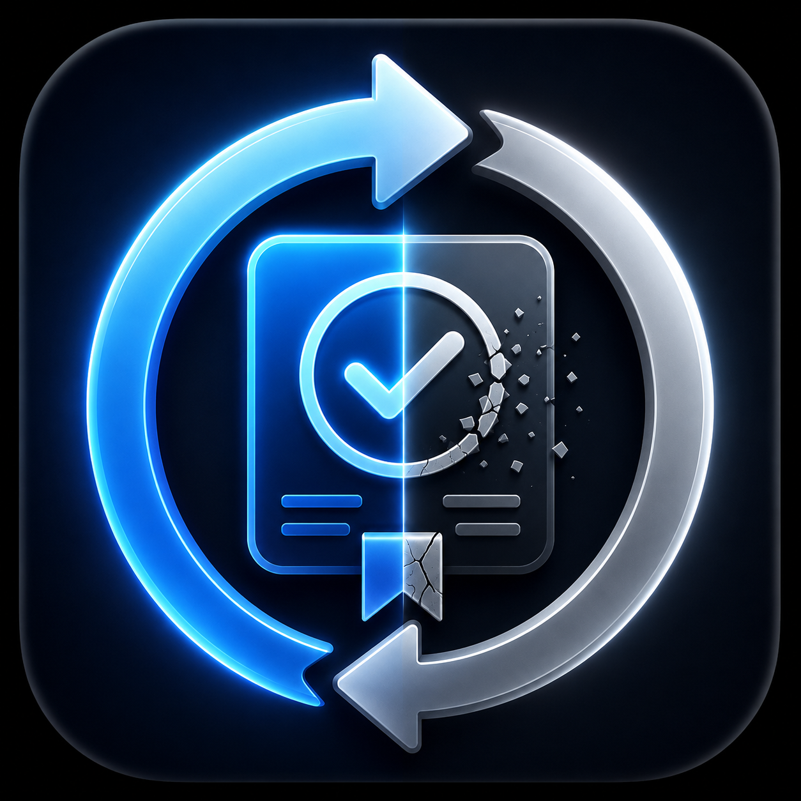

<p align="center"></p>

# ReplayGate

   

**Re-run evidence packs and detect verification drift.**

```bash
python -m replaygate pack.json          # -> REPLAY_MATCH or REPLAY_DRIFT
python -m replaygate --demo
python -m replaygate pack_a.json pack_b.json --diff
```

ReplayGate loads a sealed [EvidencePack](https://github.com/kyal102/evidencepack), re-runs its `replay_command`, recomputes the certificate from the *replayed* result, and compares it to the sealed certificate. If they differ, the check has **drifted**.

## Security (this is the point)
- **No `shell=True`.** Commands run as an argument list (`shell=False`) with a short timeout.
- **Allowlist:** only `python -m <module>` commands. Arbitrary code (`python -c`), non-Python executables, shell operators (`&&`, `|`, `;`, `>` …), destructive commands (`rm`, `del`, `curl`, `wget`, `ssh`, `powershell` …) and URLs are **rejected**.

Statuses: `REPLAY_MATCH`, `REPLAY_DRIFT`, `UNSAFE_REPLAY_COMMAND`, `REPLAY_TIMEOUT`, `REPLAY_COMMAND_FAILED`, `UNVERIFIABLE_ARTIFACT`, `MISSING_FIELDS`.

## What it is — and isn't
> ReplayGate checks whether a recorded result can be reproduced. It does not prove scientific truth or replace experiment, simulation or peer review.

See [docs/EXAMPLES.md](docs/EXAMPLES.md) · [docs/LIMITATIONS.md](docs/LIMITATIONS.md). No dependencies (pure stdlib).

## Ecosystem
Part of the public **ClaimGate** verification-tool ecosystem: ClaimGate · ClaimLint · UnitGate · EvidencePack · **ReplayGate** · ClaimStack Demo. Public lite tools; the full private engine remains private.

**AI proposes. Gates verify. Evidence records. Replay checks drift.**
